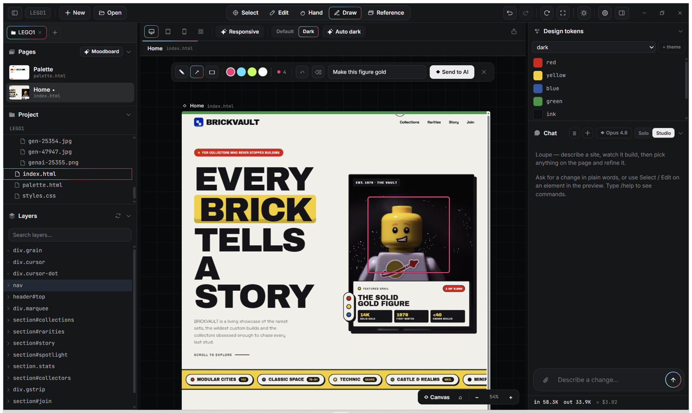

<h1 align="center">Loupe</h1>

<p align="center"><b>A desktop AI studio for designing and building real websites — an open-source, local AI website builder for Windows.</b></p>

<p align="center">
  A Windows app that pairs an AI chat with a live design canvas. Describe a site and AI agents build it,
  grounded in a bundled design library and filled with real imagery. Then refine it on the live canvas by
  hand — or point at any element and have the change verified against what actually rendered. It runs on
  Claude, your own API keys, or the AI subscriptions you already pay for.
</p>

<p align="center">
  
</p>

<p align="center">
  <a href="https://winchxyz.github.io/loupe-website/"><b>Website</b></a> ·
  <a href="#install">Download</a> ·
  <a href="#what-it-does">What it does</a> ·
  <a href="#build-from-source">Build from source</a> ·
  <a href="#contributing">Contribute</a>
</p>

<p align="center">
  
  
  <a href="https://github.com/winchxyz/loupe/releases/latest"></a>
  
  
</p>

Loupe is early (v0.1), built independently in the open — Windows-tested and unsigned. It brings your own
keys (they stay on your machine), sends nothing to a server of mine, and everything it does you can watch
it do.

## Why

AI web tools kept telling me "done" when nothing on screen had changed — or I'd ask to recolor a logo and
one of two layers would change, because the agent edits code blind, without looking at what rendered.

Loupe closes that loop: you point at the exact thing you mean, the agent edits the source, and Loupe
checks the change against the real render *before* it says done. That's what started it — and it grew into
the studio I actually wanted: agents that build a whole site, a design library to ground them, my own model
subscriptions doing the work, and a canvas where I can take over by hand.

— winchxyz

## What it does

- **Build it** — describe the site and pick how it's built: **Solo** (one fast pass) or **Studio**
  (Director → Builder → Reviewer, with a clarify gate for vague briefs). Experimental features add a
  multi-page **Swarm** (`/flow`, `/multiflow` — a planner maps the site, builders do every page in
  parallel, a reviewer fixes) and an autonomous **Loop** that iterates a page against a quality bar until
  it passes or you stop it.
- **Grounded, not generic** — every build pulls from a bundled technique library and ~1,300 original
  analyses of real sites (with extracted design tokens), and fills image slots with real licensed or
  AI-generated photos, each verified to have actually loaded.
- **Refine on the canvas** — a Figma-style canvas: select, move, resize, snap, align, auto-layout, and
  edit text and style by hand — all persisted as clean, responsive CSS, with one undo/redo across both AI
  and hand edits, and device-width previews.
- **Edit by pointing — and it's checked** — point at any element like DevTools (or sketch over it with the
  Draw tool). The agent gets the exact selectors and source files, edits them, and Loupe verifies the
  change against the real render before it says done. This is the part most AI web tools skip.
- **Bring your own engine** — Claude (Fable 5 / Sonnet 5 / Opus 4.8 / Haiku 4.5), BYOK OpenRouter / OpenAI
  / Gemini / xAI keys, or your own Codex / Grok / Copilot / MiMo subscription CLIs as build engines.
- **Round-trip to clean code** — hand-arrange on the canvas, then `/assemble` it into clean semantic HTML/CSS
  (or `/bake` tweaks in); an editable design-token panel and palette board stay in sync with the site's real CSS.

The full inventory — element picker, reference browser, smart imagery, accessibility and responsive passes,
PNG/PDF export, and more — is in **[FEATURES.md](FEATURES.md)**.

## Install

**Windows 10 / 11 (64-bit)** is the tested, supported platform. [GitHub Releases][latest] is the only
official download.

| Option | Best for | Get it |
|---|---|---|
| **Installer** (`.exe`) | Most people — installs, adds a Start-menu shortcut, and tells you when an update is out. | [`Loupe-Setup-<version>.exe`][latest] |
| **Portable** (`.zip`) | No install / no admin — unzip anywhere and run `Loupe.exe`. | [`Loupe-<version>-win-x64.zip`][latest] |
| **From source** | You want to read and build the code yourself. | [Build instructions](#build-from-source) |

The installed app checks GitHub Releases and **alerts you when a newer version is out** — you download and
install it yourself; it never updates silently. (The portable `.zip` doesn't check — re-download to upgrade.)
Downloads are **unsigned**, so the first launch of a new version shows a one-time Windows prompt:

<details>
<summary><b>“Windows protected your PC”</b> — expected for an unsigned app; here's what to click</summary>

Loupe is open-source and built by one person, and I don't pay for a Windows code-signing certificate.
Because the binary is **unsigned**, SmartScreen shows a blue **“Windows protected your PC”** screen the
first time you run a new version. It's **not** a virus alert — Windows just doesn't recognise the publisher.

1. Click **More info**
2. Click **Run anyway**

If **Run anyway** isn't shown: right-click the file → **Properties** → tick **Unblock** → **OK**, then open
it again. You'll see this once per version.

</details>

**macOS / Linux:** built and tested on Windows only — that's all I can honestly vouch for. It's an Electron
app, so the [from-source](#build-from-source) path may well run elsewhere, but I don't test it or ship those
binaries yet. If you get it running, a note or a PR is welcome.

## First run — your keys

Loupe is **BYOK** (bring your own keys). Keys are stored locally in your user profile and sent only to the
matching provider — never to me, never to the repo.

| You have | What you get |
|---|---|
| **Claude Code installed & signed in** | Everything core, no setup — Loupe picks up your existing sign-in. |
| **An Anthropic API key** (Settings → gear) | Same as above, billed per token instead of via a subscription. |
| **+ Unsplash / Pexels key** (free) | Real photography auto-filled into builds. Recommended. |
| **+ OpenRouter / OpenAI / Gemini / xAI key** | Alternative build engines, a cross-vendor QA judge, image generation. |
| **+ Codex / Grok / Copilot / MiMo CLI signed in** | Your existing subscriptions as build engines — no extra API cost. |
| **Nothing** | The app opens and is fully inspectable, but a build turn will ask you to add Claude auth first. |

The endorsed way to authenticate is your own **Anthropic API key** (Settings → Providers & keys). Loupe can
also drive your locally-installed, signed-in Claude Code — *your* CLI, at your discretion, exactly as if you
ran it yourself. It is not a hosted service and never proxies your credentials.

## Is it safe?

- **Loupe's code is open source ([MIT](LICENSE)).** The ultimate check is [building it yourself](#build-from-source).
- **Your keys stay local.** Loupe talks to the network only for the providers you configure (plus Poly Haven /
  Unsplash / Pexels asset fetches, and a GitHub update check). No telemetry, nothing proxied through me.
- **The binaries are unsigned** — the indie-economics reason above, not a comment on what the app does.
- **Loupe drives, but does not redistribute, the proprietary Claude Code CLI** (Anthropic's). You install and
  sign into it yourself. See [THIRD-PARTY-NOTICES.md](THIRD-PARTY-NOTICES.md).

Every release includes **`SHA256SUMS.txt`** so you can confirm a download is intact and unaltered:

```powershell
Get-FileHash .\Loupe-Setup-<version>.exe -Algorithm SHA256   # compare against SHA256SUMS.txt
```

A checksum proves the bytes match what was published; it doesn't prove *who* built it (that needs code
signing, which Loupe doesn't have yet). For that, build from source.

## The reference corpus

`baseline/library/references/` holds ~1,300 **original written analyses** of publicly viewable websites'
visual systems — palette roles, type scales, component anatomy, do's and don'ts — plus design tokens
extracted from them. No page markup, stylesheets, copy, or assets are reproduced; it's study material and
grounding data, in the spirit of a designer's notebook. Site names identify the subject of each analysis.
If you own one of these sites and want its entry removed, **open an issue** and it comes down.

## Build from source

You'll need **Node.js 20 or newer**.

```bash
git clone https://github.com/winchxyz/loupe.git
cd loupe/app
npm install
npm start          # launches the Electron app
npm run smoke      # boots the real app and checks the preview renders with no console errors
```

More detail, and how to propose a change, is in [CONTRIBUTING.md](.github/CONTRIBUTING.md).

## Contributing

Loupe is a solo project, but ideas and PRs are genuinely welcome.

- **Found a bug?** → [open an issue](https://github.com/winchxyz/loupe/issues).
- **Have an idea, or not sure it's a bug?** → [start a Discussion](https://github.com/winchxyz/loupe/discussions).
- **Want to write code?** → start with [`good first issue`](https://github.com/winchxyz/loupe/labels/good%20first%20issue);
  bigger things I'd love help with are [`help wanted`](https://github.com/winchxyz/loupe/labels/help%20wanted).

See [CONTRIBUTING.md](.github/CONTRIBUTING.md) and [CODE_OF_CONDUCT.md](.github/CODE_OF_CONDUCT.md). I review
when I can — it's one person, so a little patience goes a long way.

## License & attribution

Loupe's code is [MIT](LICENSE). Third-party content that ships in the repo, and the upstream projects the
pipeline learns from, are credited in [ATTRIBUTION.md](ATTRIBUTION.md); bundled fonts, icons, and the Claude
Code CLI notice are in [THIRD-PARTY-NOTICES.md](THIRD-PARTY-NOTICES.md).

Built in the open by [winchxyz](https://github.com/winchxyz). If you build something with it, I'd love to see it.

[latest]: https://github.com/winchxyz/loupe/releases/latest
